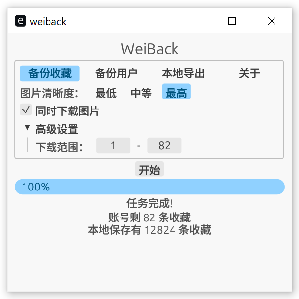

# WeiBack-rs 📥

WeiBack-rs 是一个使用Rust🦀开发的开源软件，它可以帮助你备份自己在微博上的数据。

*注意：本项目仅为技术学习和交流，请在遵守当地相关法律法规的前提下使用本项目*
------

## 特点 💡

|       亮色界面             |         暗色界面         |
:-------------------------:|:-------------------------:
|||

- 支持备份微博收藏到本地
- 支持备份PC网页端无法查看的微博
- 下载图片清晰度可选
- 可随时将本地微博数据导出为HTML
- 导出的 HTML 页面外观与 Weibo 原生界面接近，阅读体验良好
- 支持把已经备份的博文在微博平台上取消收藏
- 亮/暗主题，Windows下跟随系统

## 安装 💻
### 下载预编译可执行文件

从[Releases](https://github.com/Shapooo/WeiBack/releases)下载最新版本对应平台的预编译文件压缩包，解压即可。

### 从源码编译

- 克隆或下载本项目到本地
- 在项目根目录下运行 `cargo build --release` 命令，编译生成可执行文件
- 在生成的可执行文件同目录下新建 res 文件夹
- 将模板 `templates/` 文件夹复制到新建的可执行文件 `weiback-rs` 同目录下。即，`weiback-rs` 可执行文件需要访问到同目录下 `templates/*.html` 模板文件。

### 注意

提供 MacOS 平台的可执行文件下载，但因本人不使用 MacOS，所以不负责解决 MacOS 上**平台相关**的Bug。

------

## 使用 📜
### 准备工作
**若已经使用过本工具，可能需要进行一些准备工作，首次使用请忽略**
- `res` 文件夹的 `weiback.db` 为数据库文件，保存有备份的所有数据。
- 如果需要在新版本中使用该数据库文件，直接将其移动到新版本的 `res` 文件夹下。
- 有可能需要对数据库文件进行升级才能在新版本下使用，目前需要升级的版本有：
  - 2023-12-30 `v0.1.6`
- 请使用一同提供的 `upgrade-db-tool` 工具进行升级：在 `weiback-rs` 同目录下执行，查看日志文件判断是否成功。

### 登录

- 首次使用需要登录，启动后点击登录开始登录流程。
- 手机扫描二维码并确认。

### 微博下载

- 主界面进入`微博下载`栏。
- 目前仅支持下载微博收藏，后续将扩展更多功能。
- 可同时下载微博图片，图片清晰度可选。
- 默认下载全部收藏。
- 高级设置可设置下载范围，单位为页，每页接近20条微博（具体数目不做保证，以 weibo.com 返回为准，因此该选项只作估计）。
- 点击“开始”按钮开始任务，原始数据将下载到本地。

### 本地导出

- 主界面进入`本地导出`栏。
- 点击`开始`导出数据库中全部收藏。
- 若下载时未同时下载图片，导出时会自动下载图片。
- 选中`按时间逆序`，导出后的HTML中，最新的微博将出现在最上方。
- 点击`开始`按钮，开始对本地微博进行导出，导出格式目前支持HTML。
- 点击`对本地微博取消收藏`将取消收藏所有本地微博。注意：该操作不可逆，谨慎操作。后续将实现取消范围自由指定的功能。
- 高级选项，导出范围可设置。
- 考虑到数千数万条收藏导出到单一HTML文件带来阅读不便，默认导出每个HTML文件包含50条博文。高级选项中可设置。

*目前界面操作还比较凌乱，后续将进行优化*

## 截图或演示 📷

------

## 开发计划 📅

- [x] 微博元数据下载
- [x] 微博附带图片提取并下载
- [x] 数据库保存
- [x] HTML格式导出
- [x] 图形界面
- [x] 取消收藏
- [x] 二维码登录
- [x] 部分微博仅能在客户端查看，备份这部分博文
- [ ] 界面展示微博
- [ ] 对已经删除或无权限的微博进行过滤
- [ ] 本地微博搜索、过滤功能
- [ ] 指定微博取消收藏
- [ ] 备份指定用户博文
- [ ] ...

------

## 其它 🐵

WeiBack 的油猴脚本版本 [WeiBack](https://github.com/Shapooo/WeiBack)，也可在 [Greasyfork](https://greasyfork.org/zh-CN/scripts/466100-weiback) 下载安装。功能相比本软件较弱，仅能导出，无法保存到本地数据库。但会比较方便，适合数据不多的用户临时使用。

------

## FAQ ❓

- 为什么备份速度这么慢？
    - 因为过快的接口请求频率会增加微博官方的负载，可能增加被 ban 甚至是法律风险。因此在请求之间增加了合理的等待时间，以模拟正常的微博访问。建议备份开始后放一边做其它事。
- 为什么下载的微博有遗漏？
    - 可能是因为你在备份期间添加加或删除了收藏，导致微博返回的数据错位了。建议备份时不要在微博上进行添加或删除。
- 为什么微博显示收藏很多，但全部下载后发现没有那么多？
    - 可能原因是：博主设置了自己的微博仅半年可见，半年后就无法浏览；微博被发布者删除；因不可抗原因被平台删除等。这些微博甚至不会在网页端显示。所以会发现备份的微博数量少了很多。可以下载微博官方客户端对这些微博收藏进行集中清理。清理过程中会发现除了已经无法查看的微博，还有正常的微博没有被备份，这决不是本软件的问题喵，本软件只是忠实地收录微博返回的数据，这一定是微博返回数据的遗漏......多次进行备份->对已备份的取消收藏->对无法查看的手动取消收藏便可以解决问题。

## 问题排查 🐞

- 首先确保 `weiback-rs`（Linux平台）或`weiback-rs.exe`（Windows平台）可执行文件同目录下存在 `templates` 文件夹。该文件夹内保存有 `templates` 模板文件夹。
- 查看 `weiback.log` 日志文件排查错误。
- 通过邮箱联系我，或提交 Issue。

------

## 贡献 🤝

欢迎其他开发者参与贡献，可以通过以下方式：

- 提交 [issue](https://github.com/Shapooo/weiback-rs/issues) 报告问题或建议
- 提交 [pull request](https://github.com/Shapooo/weiback-rs/pulls) 提交代码或文档

## 开源协议 📝

本项目使用 [Apache 2.0 License](LICENSE) 开源协议。

## 联系方式 📧

如果你有任何问题或反馈，可以通过以下方式联系我：

- 邮箱：shabojia@outlook.com
